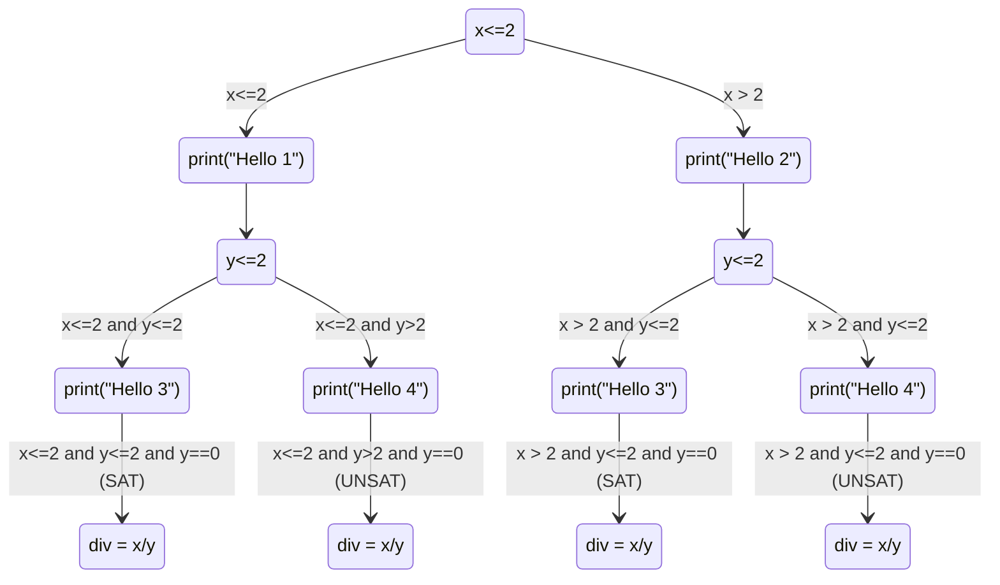

```mermaid
stateDiagram-v2
  State1: x<=2
  State2: print("Hello 1")
  State3: y<=2
  State4: print("Hello 3")
  State5: print("Hello 4")
  State6: div = x/y
  State7: div = x/y
  State8: print("Hello 2")
  State9: y<=2
  State10: print("Hello 3")
  State11: div = x/y
  State12: print("Hello 4")
  State13: div = x/y

  State1 --> State2 : x<=2
  State2 --> State3 
  State3 --> State4 : x<=2 and y<=2
  State4 --> State6 : x<=2 and y<=2 and y==0 (SAT)
  State3 --> State5 : x<=2 and y>2
  State5 --> State7 : x<=2 and y>2 and y==0 (UNSAT)

  State1 --> State8 : x > 2
  State8 --> State9 : 

  State9 --> State10 : x > 2 and y<=2
  State10 --> State11 : x > 2 and y<=2 and y==0 (SAT)

  State9 --> State12 : x > 2 and y<=2
  State12 --> State13: x > 2 and y<=2 and y==0 (UNSAT)
```

#testing 